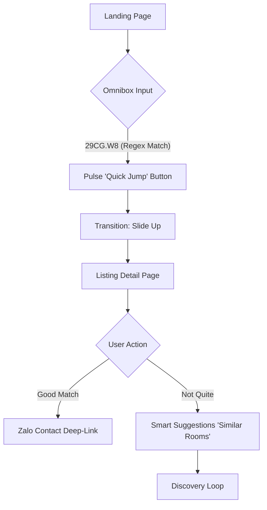
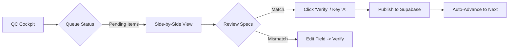

# UX Design Specification nhaminhbach

**Author:** Minh
**Date:** 2025-12-29

---

<!-- UX design content will be appended sequentially through collaborative workflow steps -->

## Executive Summary

### Project Vision
**NhaMinhBach** is the "Google of Rental Housing" in Vietnam, synthesized through a **"Her-Google-Airbnb"** design philosophy. It acts as a high-trust filter layer over the chaos of social media rental listings.
*   **Bones (Google):** Structural clarity, logic, and efficiency.
*   **Flesh (Airbnb):** High information density and smart layouts.
*   **Soul (Her):** A "Future Warmth" aesthetic—optimistic, friendly, and human-centric, rejecting the coldness of traditional tech.

### Target Users
*   **The Seeker (Hương):** Impatient, mobile-first users seeking "instant gratification" and honesty. They rely on the **Smart Search Bar** and **GeoID** for direct access.
*   **The Verifier (Minh):** Power users requiring high-throughput data processing tools (**QC Cockpit**) with zero friction.
*   **The Landlord (Cô Hiền):** Non-tech-savvy users needing professional, shareable "Vanity Links" for their Zalo workflows.

### Key Design Challenges
*   **The "Omnipotent" Search Bar:** Designing a single input field that gracefully handles direct GeoID "teleportation," guided token construction, and natural language keywords without clutter.
*   **Visual Balance:** Achieving "Airbnb density" (showing enough data to decide) while maintaining the "Her softness" (generous spacing, warm cream backgrounds, soft rounded corners).
*   **Trust vs. Speed:** Exposing "Point of Failure" data (negatives) prominently without discouraging exploration.

### Design Opportunities
*   **"Future Warmth" Palette:** Utilizing the specific **Coral (#F06D65)** and **Cream (#FDFBF7)** palette to differentiate from the sterile blue/white of competitors.
*   **Tactile "Zalo-Like" Interactions:** Optimizing touch targets and transitions (60fps) to feel as responsive and native as a chat app.
*   **Guided Query Experience:** Using interactive "chips" to guide users through query construction, minimizing typing and cognitive load.

## Core User Experience

### Defining Experience
The core experience centers on **"Visual Clarity & High-Velocity Discovery."** It balances the functional density of social apps (TikTok/Instagram) with the structured utility of a search engine. It avoids "empty minimalism" in favor of **"Organized Density"**—presenting rich information (price, location, specs) in a way that is instantly scannable and familiar to digital natives.

### Platform Strategy
*   **Mobile-First SPA:** Optimized for vertical browsing on mobile devices (360px-420px viewports).
*   **Touch Ergonomics:** "Thumb zone" navigation (Bottom Nav), large touch targets for chips/buttons, and 60fps swipe interactions.
*   **Social-Native Feel:** UI patterns that mirror popular social apps (swipable galleries, bottom sheets, overlay actions) to reduce the learning curve.

### Effortless Interactions
*   **The Magic Jump:** Typing a GeoID triggers a direct route transition, bypassing search results entirely.
*   **Scannable Specs:** Key details (elevator, floor, furniture) presented as clear, standardized icons/tags—factual and precise, not overly dramatic.
*   **Guided Tokenization:** Auto-suggesting filter "chips" as users type, turning form-filling into a fluid sentence-building experience.
*   **Organic Discovery:** "Smart Suggestions" appearing naturally at the end of a listing journey (e.g., "More rooms in this price range"), encouraging exploration.

### Critical Success Moments
*   **First Teleport:** The <300ms transition from a social post short-link to the structured listing page.
*   **The "Glance Test":** Users can assess the suitability of a room (price, location, key constraints) within 3 seconds of scanning the card/header.
*   **The "One More Look":** Finding a relevant alternative via the "Similar Listings" section just as the user is about to leave.
*   **Visual Confirmation:** Recognizing a familiar physical location via the "Real View" gallery.

### Experience Principles
1.  **Speed as a Feature:** Latency is the enemy of the "teleportation" metaphor.
2.  **Organized Density:** Present rich information without "mess," prioritizing scannability over white space.
3.  **Functional Familiarity:** Use patterns familiar to Instagram/TikTok users (visual-first, easy swipes) rather than abstract "artistic" minimalism.
4.  **Clarity Over Drama:** Present facts (even downsides) clearly and objectively.
5.  **Helpful, Not Pushy:** Recommendations should appear as helpful advice, extending the discovery loop naturally.

## Desired Emotional Response

### Primary Emotional Goals
The primary goal is **"Empowered Comfort."** Users should feel they have mastered the rental market's chaos through a tool that is hyper-efficient (Google-like) yet emotionally resonant and approachable (Her-like).

### Emotional Journey Mapping
*   **Landing:** **Relief.** Transitioning from social media "noise" to a calm, structured, and visually warm environment.
*   **Exploration:** **Clarity.** Feeling an immediate grasp of a property's value through organized data density and factual specifications.
*   **Interaction:** **Trust.** A sense of security when initiating contact, knowing the data has been refined and verified.
*   **Return:** **Familiarity.** The platform feels like a personal assistant that remembers preferences and guides discovery.

### Micro-Emotions
*   **The "Teleport" Spark:** A micro-moment of delight when a GeoID resolves instantly.
*   **Factual Confidence:** Feeling informed by objective data (floor, elevator, price history) rather than sold to.
*   **Social Connection:** The "warmth" of the Zalo deep-link, feeling like a direct line to a helpful human (Minh).

### Design Implications
*   **Human-Centric Palette → Emotional Warmth:** Using the "Future Warmth" palette (Coral/Cream) to reduce the anxiety of house hunting.
*   **Anticipatory UI → Empowerment:** Suggesting filters and listings before the user has to ask, mirroring the intuitive feed logic of TikTok/Instagram.
*   **Organized Density → Reduced Cognitive Load:** Satisfying the need for information without the stress of clutter.

### Emotional Design Principles
1.  **Warmth is the Default:** Technology should feel like an extension of human hospitality.
2.  **Accuracy over Hype:** Trust is built through precision, not marketing language.
3.  **Frictionless Flow:** Every tap should feel intentional and responsive (60fps), mimicking the fluidity of modern social apps.
4.  **Quiet Intelligence:** The system's power (AI refinery, GeoID logic) should remain in the background, only surfacing as "helpfulness."

## UX Pattern Analysis & Inspiration

### Inspiring Products Analysis
*   **Google (The Bones):** Mastery of the **"Omni-Input."** The search bar is a multi-functional dispatcher that handles direct commands (GeoID) and discovery (Keywords) with zero friction.
*   **Airbnb (The Flesh):** Mastery of **"Structured Density."** Providing enough visual and meta-data in a single view to allow for rapid decision-making without feeling overwhelming.
*   **Instagram/TikTok (The Flow):** Mastery of **"Velocity & Discovery."** Vertical scrolling habits, swipable galleries, and "Smart Suggestions" that encourage endless, organic exploration.
*   **Film *Her* (The Soul):** Mastery of **"Tactile Warmth."** Using a human-centric palette (Cream/Coral) to transform a transactional search into an emotional experience.

### Transferable UX Patterns
*   **The "Waterfall" Dispatcher:** A single entry point that intelligently routes users based on input type (Regex Jump vs. Keyword Search).
*   **Organically Nested Suggestions:** Placing "Similar Listings" in the natural eye-path at the end of a listing journey, mirroring the "next video" logic of TikTok.
*   **High-Density Scannable Cards:** Using a rigid grid and clear hierarchy (Bones) to present swipable media and key specs (Flesh).
*   **In-Context Bottom Sheets:** Using non-disruptive overlays for filtering and metadata, keeping the user anchored in their search.

### Anti-Patterns to Avoid
*   **Minimalist Vacuity:** Avoiding the "Apple-style" empty space that frustrates power-users seeking information density.
*   **Search Dead-Ends:** Ensuring that a query with no matches always offers a "Bridge" to alternative listings.
*   **Transactional Coldness:** Avoiding the sterile blue/white/gray palettes common in real estate that feel impersonal.

### Design Inspiration Strategy
*   **What to Adopt:** The "Omnibox" logic from Google for the search bar and the "Suggestion Loop" from social media for listing pages.
*   **What to Adapt:** The high-density information cards from Airbnb, softened with the color palette and rounded corners from the *Her* aesthetic.
*   **What to Avoid:** Intrusive ad-like placements. All suggestions must be context-aware and helpful to the seeker's current intent.

## Design System Foundation

### 1.1 Design System Choice
The project will utilize a **Themeable Utility System** founded on **Tailwind CSS**, paired with headless component libraries (e.g., Headless UI, Radix UI) for accessibility and complex logic.

### Rationale for Selection
*   **Visual Sovereignty:** Allows for precise implementation of the **"Her"** aesthetic (specific coral/cream palette and soft radius) without fighting against pre-built component styles.
*   **Information Density:** Tailwind's utility-first approach is ideal for crafting the **"Organized Density"** required for Airbnb-style cards and Google-style search bars.
*   **Mobile-First Performance:** Ensures a lightweight CSS footprint, critical for achieving the **<1.5s FCP** and **60fps** mobile interaction goals.
*   **Developer Velocity:** Leverages the team's existing configuration in `packages/web/tailwind.config.js` to maintain a single source of truth for design tokens.

### Implementation Approach
*   **Utility-First Construction:** Building all UI patterns from the ground up using Tailwind utilities to ensure maximum responsiveness and brand alignment.
*   **Headless Interactivity:** Utilizing logic-only libraries to power the "Smart Waterfall Search Bar" and mobile bottom sheets, ensuring high accessibility while maintaining custom styling.
*   **Pattern Library:** Developing a modular set of project-specific components (e.g., `GeoIDLink`, `ListingCard`, `SmartSuggestionGrid`) to ensure consistency across the application.

### Customization Strategy
*   **"Future Warmth" Tokens:** Strictly adhering to the defined palette (`primary: #F06D65`, `background: #FDFBF7`) and typography (`Inter`).
*   **Soft Geometry:** Consistently applying `rounded-xl` for cards and `rounded-lg` for interactive elements to mirror the organic soul of the *Her* aesthetic.
*   **Visual Scannability:** Prioritizing high-contrast typography and clear spacing hierarchies to satisfy the "Scan-First" habits of social media users.

## 2. Core User Experience

### 2.1 Defining Experience
The defining interaction is the **"Smart Waterfall Search."** It serves as the application's central nervous system, intelligently parsing diverse user inputs—GeoIDs, price constraints, location names—and instantly routing the user to the most specific possible result (Teleportation, Filtered View, or Search Results).

### 2.2 User Mental Model
*   **Legacy Model:** "I must select a district, then a ward, then a price range using 5 different dropdowns."
*   **NhaMinhBach Model:** "I just tell the search bar what I want (or where I want to go), and it takes me there."
*   **Metaphor:** The **"Digital Concierge"**—it understands shorthand, specific codes, and vague requests equally well.

### 2.3 Success Criteria
*   **Zero-Hop Navigation:** 20% of sessions should result in a direct "Teleport" to a listing page, bypassing the grid view entirely.
*   **Intent Recognition:** The system correctly identifies price queries (e.g., "3tr") vs. location queries (e.g., "Bach Khoa") in >95% of cases.
*   **Trust in Dispatch:** Users stop using manual filters because the search bar proves faster and more accurate.

### 2.4 Novel UX Patterns
*   **The Waterfall Dispatcher:** A unified input logic that prioritizes **Identity** (GeoID) > **Entity** (Filter chips) > **Keyword** (Text search). This flattens the navigation hierarchy into a single input.
*   **Guided Intent Chips:** As users type ambiguous terms (e.g., "3"), the UI offers structured interpretations (`[Price: 3 million]`, `[Floor: 3]`) to disambiguate intent on the fly.

### 2.5 Experience Mechanics
*   **Initiation:** The Search Bar is the dominant visual element on the home screen ("Google-style"). On scroll, it morphs into a persistent top-nav or floating action button.
*   **Interaction:**
    *   *State 1 (Empty):* Shows "Smart Suggestions" and recent history.
    *   *State 2 (Typing):* Real-time parsing. If regex matches a GeoID, a "Quick Jump" button pulses.
    *   *State 3 (Selection):* Tapping a result triggers a transition—slide-left for listing details (Teleport) or fade-in for grid results.
*   **Feedback:** "Smart Chips" appear below the input to confirm how the system interpreted the text (e.g., converting "cau giay" into a `[District: Cau Giay]` chip).

## Visual Design Foundation

### Color System
The color system, titled **"Future Warmth,"** is designed to reject clinical tech aesthetics in favor of a human-centric, optimistic atmosphere inspired by the film *Her*.

*   **Primary (Coral - #F06D65):** Used for primary actions (Call to Action), active states, and brand highlights.
*   **Background (Warm Cream - #FDFBF7):** A soft, light-reflective base that reduces eye strain and provides a tactile, "papery" feel.
*   **Surface (Pure White - #FFFFFF):** Utilized for cards and navigation layers to create a clean, "Google-style" contrast against the cream background.
*   **Typography (Charcoal - #2C2C2C):** A deep, soft gray used for primary text to avoid the harshness of pure black.
*   **Accent (Dusk Blue - #6C8B9A):** A cooling contrast for secondary tags, status indicators, and success messages.

### Typography System
*   **Typeface:** **Inter** (Variable). Chosen for its technical clarity (Google bones) and friendly, rounded letterforms (Her soul).
*   **Hierarchy:**
    *   **Headlines (h1-h3):** Semi-bold weight, Charcoal color.
    *   **Body Text:** Regular weight, 16px base, 1.5 line height for readability.
    *   **Metadata/Captions:** 14px, Secondary Gray color for scannability.
    *   **Callouts (Prices/GeoIDs):** Bold weight, Primary Coral or Charcoal.

### Spacing & Layout Foundation
*   **Base Unit:** 4px (Tailwind standard).
*   **Layout Philosophy:** **"Organized Density."** Prioritizing vertical scannability for mobile-first users while maintaining a clear grid system for structural logic.
*   **Corner Geometry:** Organic and soft.
    *   **Primary Cards/Media:** `rounded-xl` (12px).
    *   **Buttons/Inputs:** `rounded-lg` (8px).
*   **Spacing Hierarchy:** Generous external margins (16px/20px) paired with tight internal component spacing (8px/12px) to achieve "Airbnb-style" density.

### Accessibility Considerations
*   **Contrast Ratio:** Maintaining a minimum of 4.5:1 for all functional text elements.
*   **Touch Targets:** Enforcing a minimum 44px hit area for all buttons and interactive chips to accommodate one-handed mobile use.
*   **Vietnamese Legibility:** Optimizing line-height (1.5-1.6) to ensure diacritic marks do not overlap or feel cramped in dense listing descriptions.

## Design Direction Decision

### Design Directions Explored
We explored six distinct directions, ranging from "Social Feed" (TikTok-style) to "Concierge Search" (Google-style) and "Property Magazine" (Airbnb-style). The goal was to balance high information density for Gen Z users with the emotional warmth of the "Her" aesthetic.

### Chosen Direction
**"Hybrid: The Social Concierge"**
This direction synthesizes the best elements of the explored concepts:
*   **Layout:** **Airbnb Density** (Grid of 2 on mobile) with **IG-style swipable cards** for immediate visual engagement.
*   **Search:** **Google-style Omnibox** that acts as the persistent "Digital Concierge," handling all navigation.
*   **Vibe:** **Her-style Warmth** (Cream/Coral palette, soft rounded corners) to differentiate from cold competitors.
*   **Discovery:** **TikTok-style Suggestions** integrated organically at the end of scroll journeys to encourage "One More Look."

### Design Rationale
*   **Familiarity:** Leverages the "Feed" mental model of social apps, reducing the learning curve for Gen Z users.
*   **Efficiency:** The "Omnibox" provides a power-user shortcut (Teleportation) without cluttering the UI with filters.
*   **Trust:** The "Future Warmth" palette creates an emotional buffer against the stress of house hunting, reinforcing the brand's "friendly expert" persona.

### Implementation Approach
*   **Component Strategy:** We will build high-fidelity components (Cards, Search Bar) that encapsulate this hybrid logic (e.g., a Card component that handles swipe gestures internally).
*   **Layout Engine:** Using CSS Grid/Flexbox to create a responsive "Masonry-lite" layout that adapts density based on viewport size (1-col mobile, multi-col desktop).

## User Journey Flows

### Journey 1: The "Teleport" (Direct Access)
**Goal:** A user with a specific intent (GeoID) instantly navigates to the target property, bypassing all search friction.



### Journey 2: The "Guided Discovery" (Browsing)
**Goal:** A user with vague intent ("3 million, near school") is guided through a social-style feed to find a match.

```mermaid
graph TD
    A[Landing Page] --> B{Omnibox Input}
    B -- "3tr" (Text) --> C[Suggest Chip: [Price < 3m]]
    C --> D[Feed View: 2-Col Grid]
    D --> E[Swipe Card Gallery]
    E -- "Tap Card" --> F[Listing Detail Bottom Sheet]
    F --> G[Scroll to Bottom]
    G --> H[Algorithm: 'More like this']
    H --> D
```

### Journey 3: The "Verifier" (Admin QC) & Manual Entry
**Goal:** The admin rapidly validates incoming scraped data or manually inputs new listings using the unified interface.



### Journey Patterns
*   **The "Never-Empty" Dispatch:** Every input in the Omnibox results in a structured suggestion (Chip or Jump), never a "0 results" dead end.
*   **The "End-of-Scroll" Hook:** Every detail view ends with "Smart Suggestions" to maintain the session loop, preventing exit after a mismatch.
*   **Deep-Link Handoff:** All conversion points (Contact) hand off to Zalo with context (GeoID pre-filled), creating a seamless Web-to-Chat bridge.

### Flow Optimization Principles
1.  **Input Anticipation:** The system anticipates the user's intent (ID vs. Price vs. Location) before they finish typing.
2.  **Context Preservation:** Browsing detail views (Bottom Sheets) keeps the main feed visible underneath, maintaining the user's "place" in the scroll.
3.  **One-Tap Actions:** Primary actions (Contact, Verify) are always exposed at the bottom of the viewport (Thumb Zone).

## Component Strategy

### Design System Components (Headless Wrappers)
We will utilize **Headless UI** (React) wrapped in **Tailwind CSS** to provide the accessible foundation for standard interaction patterns.
*   **`BaseButton`:** Implements the `rounded-lg` and "Coral/Cream" variants.
*   **`MobileDrawer`:** A robust, accessible bottom-sheet component for mobile detail views.
*   **`InfoModal`:** Standard dialogs for desktop interactions.
*   **`ToastNotification`:** Non-intrusive alerts for system feedback.

### Custom Components (Project-Specific)

#### `OmniSearchInput`
**Purpose:** The central navigation dispatcher.
**Anatomy:** A complex input container featuring a left-icon (Search/GeoID), the text field, and a right-action group (Clear/Submit/Pulse).
**States:**
*   *Idle:* Placeholder "Search by ID (29CG...) or keyword".
*   *Parsing:* Shows a loading spinner or "Computing" indicator.
*   *Match (Regex):* The right-action button transforms into a pulsing "Teleport" icon.
*   *No Match:* Shows a "Search" icon.
**Interaction:** Auto-expands suggestions dropdown on focus.

#### `ListingCard`
**Purpose:** The primary unit of content consumption.
**Anatomy:**
*   *Header:* Image carousel (swipable) with Price Badge overlay.
*   *Body:* High-density grid: [District] | [Ward] | [Specs Icons].
*   *Footer:* "Point of Failure" snippet (e.g., "4th floor, stairs").
**Interaction:** Tapping the body opens the Detail Sheet; tapping the "Contact" icon deep-links to Zalo.

#### `SmartSuggestionGrid`
**Purpose:** Organic discovery engine.
**Anatomy:** A horizontal scrolling container of mini-cards.
**Content:** "Similar Price," "Same District," or "You Might Like."
**Placement:** Appears at the bottom of the Detail Sheet and Empty Search states.

### Component Implementation Strategy
*   **Compound Component Pattern:** We will use React Compound Components (e.g., `<Card><Card.Image /><Card.Body /></Card>`) to allow for flexible layout variations within the `ListingCard`.
*   **Slot-Based Layout:** The `OmniSearchInput` will accept "Slots" for left/right elements to allow it to morph between context (Home vs. Nav).
*   **Design Tokens First:** All components must strictly consume the Tailwind tokens (`bg-background`, `text-primary`) to ensure theme consistency.

### Implementation Roadmap
1.  **Phase 1: The Core Loop** (`OmniSearchInput`, `ListingCard`, `BaseButton`).
2.  **Phase 2: The Detail Experience** (`MobileDrawer`, `SmartSuggestionGrid`, `SmartChipGroup`).
3.  **Phase 3: The Admin Tools** (`QCSideBySide`, `AdminTable`).

## UX Consistency Patterns

### Button Hierarchy
*   **Primary (Solid Coral):** Reserved for the single most important action on a screen (e.g., "Contact via Zalo", "Quick Jump").
*   **Secondary (Soft Cream w/ Border):** Used for alternative actions like "Share" or "Save". Maintains the papery aesthetic.
*   **Tertiary (Ghost Charcoal):** Used for "Cancel" or "Close" actions to reduce visual noise.
*   **Floating Action Button (Pulse):** A contextual button that appears only when a high-probability action (like a GeoID match) is detected.

### Feedback Patterns
*   **Micro-Toasts:** Non-blocking, pill-shaped notifications that appear at the bottom-center of the viewport for system status (e.g., "Link Copied").
*   **Inline Intelligence:** Error messages should be helpful suggestions, not reprimands. (e.g., Instead of "Invalid ID", say "Did you mean 29CG...?").
*   **Skeleton Loading:** Use shimmering content placeholders that match the "Airbnb Density" layout to reduce perceived latency during data fetches.

### Navigation Patterns
*   **The "Concierge" Bar:** The Omnibox acts as the primary navigation tool. It persists across the Home and Search results views.
*   **Bottom Sheets over Pages:** On mobile, detail views and filters open as swipable bottom sheets (`z-index: 50`), keeping the underlying feed visible to maintain context (`z-index: 10`).
*   **Gesture Navigation:** All detail views must support a "Swipe Down to Close" gesture, mimicking native social apps.

### Empty State Patterns
*   **The "No Dead Ends" Rule:** An empty search result must **always** return:
    1.  **Nearby Options:** "No rooms in [Ward X], but here are some in [Ward Y]."
    2.  **Popular Searches:** "Try searching for..."
    3.  **Smart Chips:** One-tap triggers to broaden the search (e.g., "Clear Price Filter").

### Form Patterns (The Anti-Form)
*   **Chip-Based Input:** Instead of traditional form fields, users construct queries using "Smart Chips" (e.g., `[< 3m]` `[Cau Giay]`).
*   **Progressive Disclosure:** Advanced filters (e.g., "Has AC") are hidden behind a "More" chip or bottom sheet, keeping the initial interface clean.

## Responsive Design & Accessibility

### Responsive Strategy
*   **Mobile-First Core:** The application is architected primarily for 360-430px wide viewports. The layout defaults to a single-column, high-density vertical feed.
*   **Adaptive Density:**
    *   **Mobile (<768px):** Single column. "Airbnb-style" cards (100% width). Bottom navigation.
    *   **Tablet (768px - 1024px):** Two-column masonry grid. Navigation shifts to a collapsible sidebar.
    *   **Desktop (>1024px):** Multi-column masonry (3-4 cols). The "Omnibox" becomes a permanent hero element centered in the header.
*   **Feature Parity:** 100% of features (searching, contacting, admin verification) must be executable on mobile.

### Breakpoint Strategy
We adhere to the standard **Tailwind CSS** breakpoint system to maintain developer velocity:
*   `sm` (640px): Adjust card margins for larger phones.
*   `md` (768px): Trigger multi-column grid layout.
*   `lg` (1024px): Activate "Desktop Mode" (Side-by-Side Admin View, Persistent Header).
*   `xl` (1280px): Maximum content width constraints to prevent layout stretching on ultra-wide monitors.

### Accessibility Strategy (WCAG 2.1 AA)
*   **Keyboard Sovereignty:** The "Smart Waterfall Search" must be fully navigable via keyboard (Up/Down arrows for suggestions, Enter to route, Esc to clear).
*   **Touch Targets:** All interactive elements (Chips, Buttons, Icons) strictly enforce a **minimum 44x44px** hit area.
*   **Semantic Structure:** Use proper heading hierarchy (H1 -> H6) within Listing Cards to ensure screen readers can "scan" the feed effectively.
*   **Contrast Compliance:**
    *   Primary Text (`#2C2C2C`) on Background (`#FDFBF7`) = ~13:1 (Passes AAA).
    *   Secondary Text (`#757575`) on Background = ~4.6:1 (Passes AA).
    *   *Constraint:* Avoid using Coral (`#F06D65`) for thin text on white backgrounds; use for buttons/icons only.

### Implementation Guidelines
*   **Relative Units:** Use `rem` for typography and spacing to respect user system font settings.
*   **Media Queries:** Write CSS mobile-first (e.g., `<div class="block md:flex">`), avoiding `max-width` overrides unless absolutely necessary.
*   **ARIA Labels:** Explicitly define `aria-label` for all icon-based controls (e.g., "Favorite", "Share", "Zalo Contact") where no text label exists.
