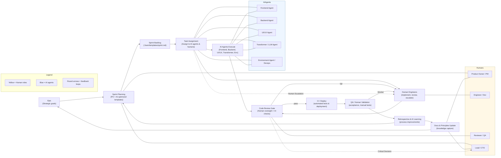
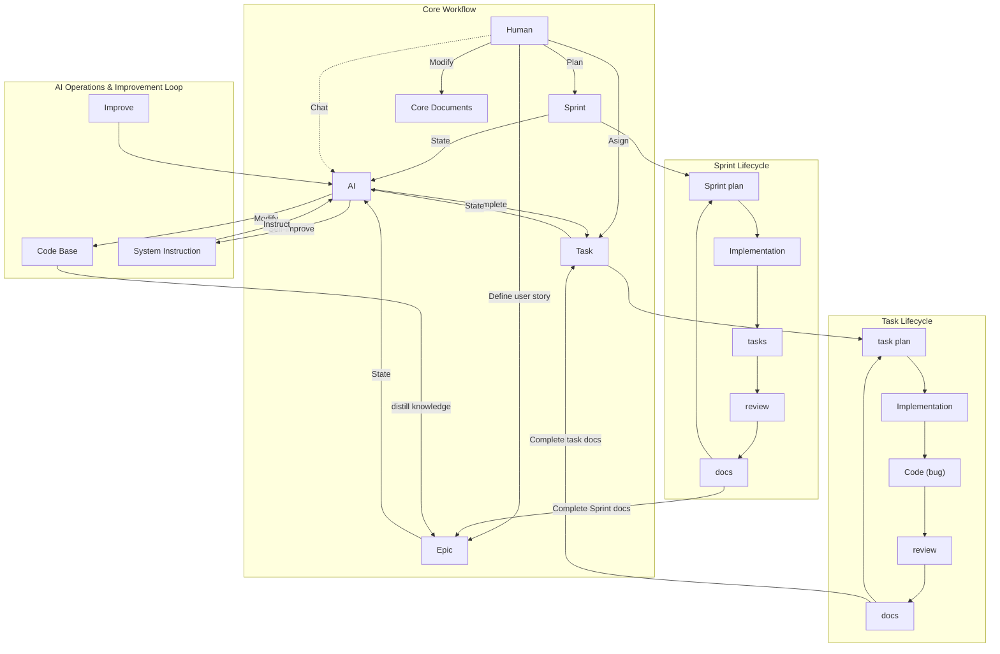

<!-- # AI + Human Development Process Diagram

This diagram models the current development workflow in this repository: epics → AI-optimized sprint planning → AI + human execution → code review & deployment → retrospective & knowledge capture. It highlights human roles, AI agent roles, artifacts, and escalation/quality gates.

Below is a Mermaid flowchart you can preview in editors that support Mermaid (VS Code Mermaid Preview, GitHub, Obsidian, etc.). -->

<!-- Notes and references
- Sprint timebox: 2–6 hours (see `nhaminhbach_knowledge/process/sprint_planning.md`).
- AI agent handoff patterns: `nhaminhbach_knowledge/process/ai_agent_briefing_guide.md`.
- Sprint templates & artifacts: `.foam/templates/sprint.md` and `nhaminhbach_knowledge/strategy/sprint/*`.
- Retrospective-driven process updates: see `nhaminhbach_knowledge/strategy/sprint_retrospective_s8.md`.

How to use
- Open this file in an editor supporting Mermaid to preview the diagram.
- If you want an export (SVG/PNG) or a PlantUML version, tell me which format and I will add it. -->

